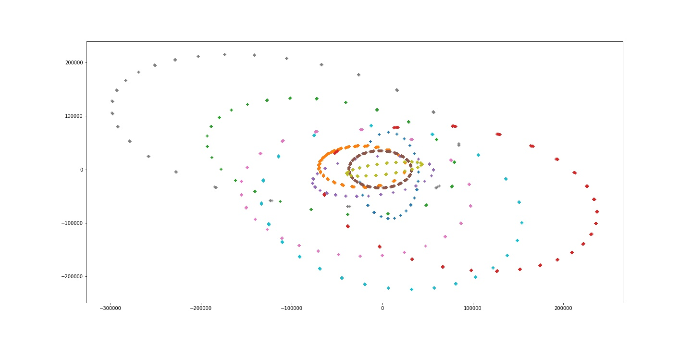

# Astro Analytics Challenge - IITM

## Overview 

This challenge is to predict the position and velocity of satellite at any time, t. Given data includes the geographical coordinates and velocities in 3-dimensions. It inculdes the actual values and instrument values. Since, instrument values may have some noise. Hence, main aim of the challenge is to find a suitable distribution of noise.
 
Below is an example of 

1. Training data point -

    sat_id | date | x act | y act |z act |x inst|y inst|z inst|Vx act | Vy act |Vz act |Vx inst|Vy inst|Vz inst|
    -------|-------|-------|-------|-------|-------|-------|-------|-------|-------|-------|-------|-------|-------|
    \#\#\# |\#\#\# |\#\#\# |\#\#\# |\#\#\# |\#\#\# |\#\#\# |\#\#\# |\#\#\# |\#\#\# |\#\#\# |\#\#\# |\#\#\# |\#\#\# |

2. Testing data point

    |sat_id | date | x inst|y inst|z inst|Vx inst|Vy inst|Vz inst|
    |-------|-------|-------|-------|-------|-------|-------|-------|
    |\#\#\# |\#\#\# |\#\#\# |\#\#\# |\#\#\# |\#\#\# |\#\#\# |\#\#\# |


## EDA

After performing the [EDA](./notebook/EDA.ipynb) for the given data we have found out that every satellite is moving in a plane. Hence, position and velocity of a satellite can be defined with two parameters. And there is very less variation in position and velocity of satallite for multiple rotation. 

Each satellite has its own path for rotation. Hence, whole data is spillted into *N* datasets (N = #Sattelites) and a separate is model prepared for each sattelite.

<p align = center>
<b>Below is an example of trajectory</b>
</p>

<p align = center>


</p>


## Model Preparation

1. PCA model for each satellite and obtaining 2 useful parameters. Here, two useful dimensions
2. Training a separate K-Nearest Neighbour model for each satellite. I choose K-Nearest Neighbour because at any point of time, it's velocity and position is highly dependent on its position and velocity in nearby positions
3. Prediction for each satellite at any time

## Installation

1. [requirements.txt](requirements.txt) includes the packages required for this project. 
    Run the below mentioned command in console
    ``` python 
        pip install -r requirements.txt 
    ``` 
2. Running [train.sh](train.sh) performs training on the dataset and stores the results in the specified folder. Run the below mentioned command in console
    ``` python
        sh train.sh
    ```